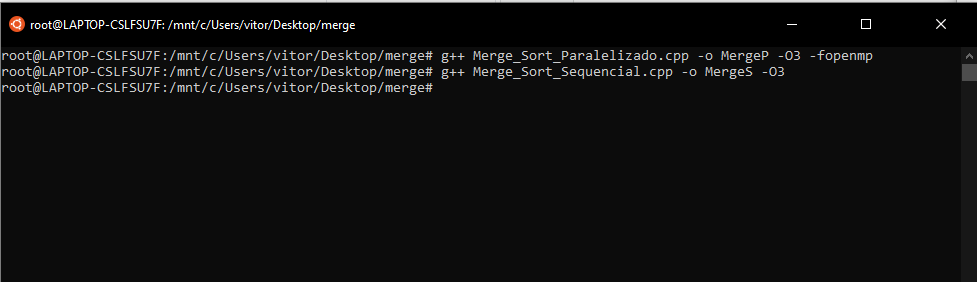
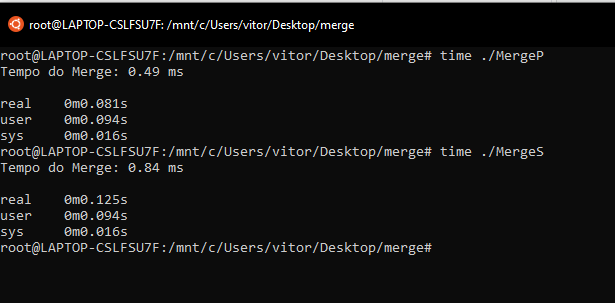
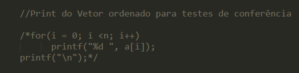

# Algoritmo Merge Sort Sequencial e Paralelizado com OpenMP - Feito em C++
## Instruções de compilação do algoritmo:
### Compilador usado durante o projeto: GCC 7.5.0 com auxílio do WSL Ubuntu   Para realizar a compilação dos programas baixe os dois códigos em .cpp disponíveis no Release deste repositório ou clone o repositório em seu Desktop. Feito isso,localize a pasta que contêm os códigos, com seu compilador, e digite os seguintes comandos:
#### g++ Merge_Sort_Paralelizado.cpp -o MergeP -O3 -fopenmp g++ Merge_Sort_Sequencial.cpp -o MergeS -O3 

  

### Após a compilação do programa,será gerado dois arquivos: 
#### MergeP (Versão Paralelizada) e MergeS(Versão Sequencial)  
## Para realizar o teste de cada versão utilize o seguinte comando:
### time ./[Nome do programa] ou ./[Nome do programa] 

## Verificando desempenho dos programas
### Para verificar o desempenho,pode ser usado o cronômetro da função Merge que foi colocado dentro do código ou utilizar a função time ao executar o programa,como descrito acima. Uma demonstração de como é exibido o programa pode ser conferida abaixo:
 

  

### O tempo marcado como "Tempo do Merge" é o tempo referente ao quanto demorou para que fosse feito a chamada da função mergeSort até o programa finalizar toda a ordenação do vetor.  O tempo marcado como "real" é o tempo que o programa gastou para ser executado do ínicio ao fim,contanto com a alimentação de valores randômicos do vetor. 

## Conferir se a ordenação dos vetores foi feita com sucesso
### Para conferir se a ordenação foi feita corretamente é necessário retirar o comentário referente ao print do vetor ordenado em ambos os códigos,compilar novamente e realizar o teste de execução. 
#### Código Sequencial: Retirar os parâmetros de comentário entre as linhas 27 e 29 do código    Código Paralelizado: Retirar os parâmetros de comentário entre as linhas 35 e 37 do código. 
### Abaixo pode ser conferido o trecho de código que deve ter seus parâmetros /* e */ retirados:

  

